# Tutorial Setup Anaconda & UV
**Nama** : Doni Wahyudi  
**No. Absen** : 9.043.DB2025
---
Halo Semua!👋 <br>
Buat teman-teman yang lagi belajar coding pake Python, ada Tools yang menarik nih buat kita coba dan pastinya nanti bakal kepake saat kita udah mulai ngebuat project, yaitu : <br> **Anaconda** dan **UV**
<br>Waduh apaan tuh? Kok ada jenis uler lain lagi selain python, dan yang satu nya lagi namanya kaya sinar dari matahari 🤔
<br>Eits, bukan yang itu kok, daripada bingung mending yuk kita bahas 🙌

---

## 🔍 Part 1.  Apa itu Anaconda dan UV
### 🐍 Anaconda
**Anaconda** adalah platform distribusi Python yang dilengkapi berbagai tools untuk analisis data, AI, dan sains. Di dalamnya sudah ada Python, Jupyter, dan banyak library lainnya.
<br>
Ibarat nya kita lagi cari tempat tinggal, nah anaconda ini kaya kos-kosan atau apartemen yang udah full furnish, semua nya lengkap di dalam nya.
<br>
💡Cocok nya buat apa si Anaconda ini?
- ✅ Buat pemula di python karna dapat semua package lengkap
- ✅ Buat yang fokus di data science, machine learning, AI, dan Riset
- ✅ Library nya banyak, siap pakai

### ⚡ UV
Kalau **UV** adalah tools Python terbaru yang super cepat untuk bikin environment virtual dan install library. UV dirancang untuk menggantikan pip, venv, dan pip-tools dengan satu tool serba bisa yang ringan dan cepat.
<br>
Analogi nya kaya kontrakan yang masih kosong belum ada apa-apa dan nanti kita yang bakal ngisi semua perabotannya.
<br>
💡Cocok nya buat apa si UV ini?
- ✅ Programmer/ developer yang butuh performa biar program nya cepat dan ringan
- ✅ Ukurannya kecil dan setup nya cepat
- ✅ Kita bisa tentuin library apa aja yang mau kita pakai sesuai kebutuhan

## Part 2. Perbedaan Anaconda dan UV
Kapan kita pake anaconda, kapan kita pake UV? <br>
Jawabannya bisa kita liat lewat tabel ini 👇
| Kategori | **Anaconda**| **UV** |
|----------|-------------|--------|
| 💻 Untuk siapa?| Orang yang fokus di **data science, AI, statistik** | Programmer/developer Python yang mau **cepat dan ringan** |
| 🎁 Isi | Python + 1000+ tools siap pakai | Kosong, kamu install sendiri |
| ⚙️ Cara kerja | Pakai `conda` buat atur lingkungan & package | Pakai `uv` buat bikin environment & install package |
| 🐢 Ukuran | Berat (ukuran besar, banyak isi) | Ringan dan super cepat |
| 📦 Instalasi package | Lewat `conda install` | Lewat `uv add` |
📈 Performa | Lambat saat install | Cepat banget! |

## Kegunaan Anaconda dan UV
Kenapa kita perlu pakai anaconda atau UV? Bukannya kita bisa tinggal langsung aja install library yg kita mau pake pip?
<br>
Memang betul, kita bisa install langsung, tapi ada banyak manfaat kalo kita pakai ini:
- 🔒 Aman<br>
Nggak bentrok sama proyek lain, jadi bisa bereksperimen dengan tenang tanpa khawatir menyenggol projek lain
- 🔁 Reproducable<br>
Bisa dibuat ulang di environment atau laptop lain dengan setup yang sama, jadi ga perlu bingung semisal make laptop nya ganti-gantian
- 🚀 Efisien<br>
Bisa atur versi package sesuai proyek masing-masing, ga perlu pusing semisal nanti kalo ada yang ga kompatibel di versi terbaru karena bisa kita sesuaikan sama versi yang kita tentukan

Jadi kalau tanpa menggunakan anaconda atau uv, kita bakal agak kesulitan ketika ngerjain project yang banyak dan menggunakan library/package yang berbeda-beda.

## Cara Pengunaan
### 🐍 Anaconda
#### Step 1 : Download
- Kamu bisa download Anaconda di web resmi nya 👉[disini](https://www.anaconda.com/download)👈
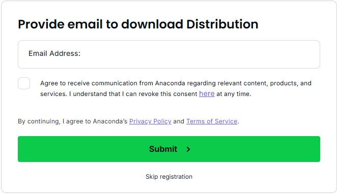
>✔️ Pas bagian ini bisa di skip registration aja, atau kalo mau dapet penawaran dari anaconda nya boleh-boleh aja di submit email nya (supaya email nya ga sepi 😏)

- Selanjutnya klik `Download` sesuai OS laptop kamu dan tunggu sampai proses download selesai (ukurannya 912 MB)
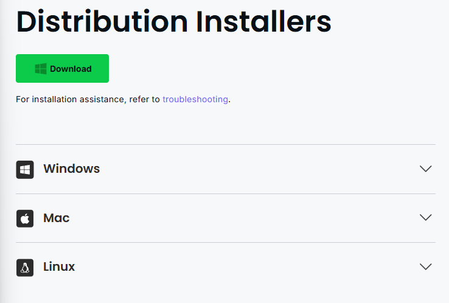
> ✔️ Pastiin kuota kamu cukup atau cari tempat yang ada WiFi nya, bisa juga minta tethering ke temen (tapi diem2 aja 😆)  
#### Step 2 : Instalasi
- Setelah selesai di download, buka file tadi yang namanya `Anaconda3-2024.10-1-Windows-x86_64`, terus klik `Next >`
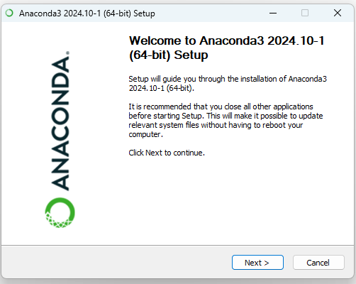
- Kemudian klik `I Agree`
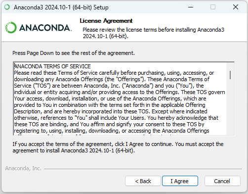
- Abis itu klik `Just Me (recommended)`


- Pilih lokasi instalasi nya, kemudian klik `Next >`  


> ❗lokasi instalasi nya pakai yang default aja di C:\Users\{nama_user_kita}\anaconda3

- Pastikan di centang:
    - ✅Add Ananconda3 to my PATH environment variable
    - ✅Register Anaconda3 as my default Python 3.12


  > ❗Ikuti setiap step by step nya dengan sesuai agar instalasi nya berjalan dengan lancar, tapi kalau kamu sudah paham ya boleh-boleh aja buat di custom
- Klik `Install` dan tunggu sampai selesai 💯
- Buka command prompt (cmd) dan ketik `conda --version`
- kalau muncul output seperti `conda 24.9.2` berarti instalasi berhasil ✅

#### Step 3 : Buat Environment
Setelah selesai instalasi nya, selanjutnya kita bisa langsung buat environment yang baru buat project kita, caranya:
- Buka command prompt (cmd), ketik atau copy command berikut:
```bash
conda create --name {namaprojectmu} python=3.9.13
```
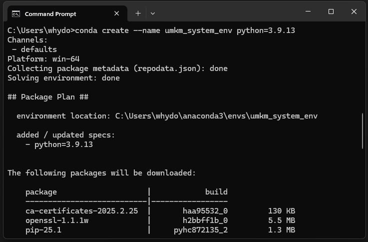
- saat proses, akan ada permintaan persetujuan tentang apa saja yang akan di install, ketik `y` untuk melanjutkan  


- setelah selesai, kamu bisa menggunakan environment tadi dengan mengetik:
```bash
conda activate {namaprojectmu}
```
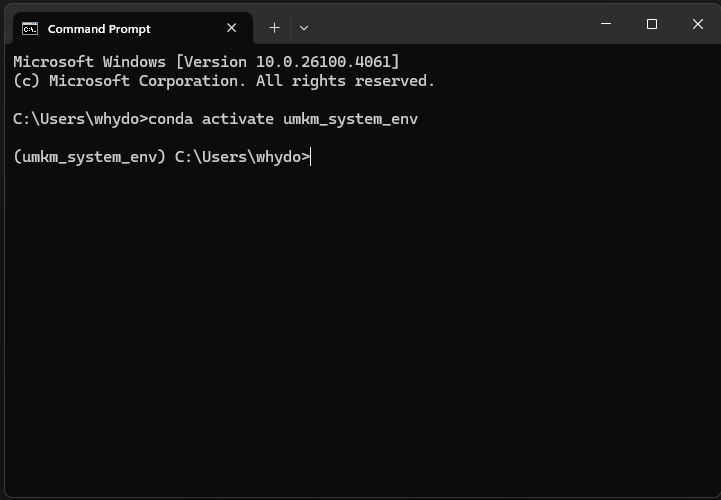

- saat sudah di aktivasi environment nya, kamu bisa install package yang dibutuhkan, contoh:
```bash
conda install pandas
```


- setelah selesai menggunakan environment nya, kamu bisa men-deaktivasi environment tersebut dengan cara:
```bash
conda deactivate
```
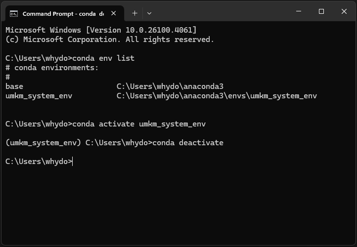

### ⚡UV
#### 1. Instalasi
- Kita awali dengan install uv dulu dengan mengetik di command prompt:
```bash
pip install uv
```
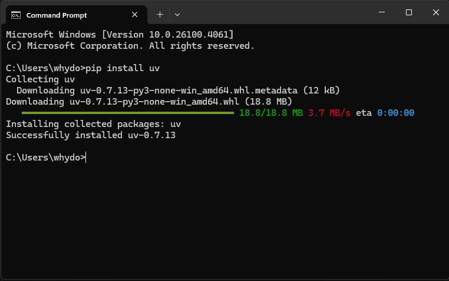
- Setelah terinstall, selanjutnya kita akan menginisialisasi project UV menggunakan command berikut:
```bash
uv init {namaprojectmu}
```
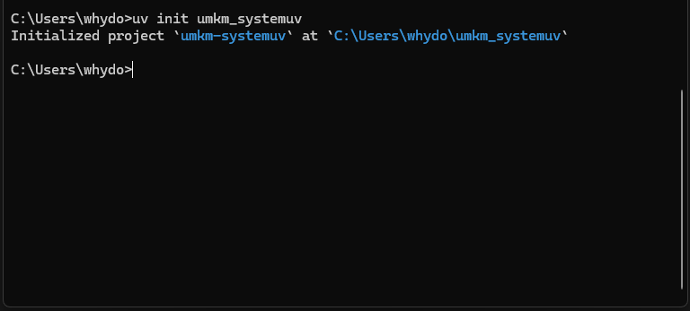
- Langkah selanjutnya, kita pindah ke direktori project yang sudah dibuat tadi dengan menggunakan command:
```bash
cd {namaprojectmu}
```
- Kemudian kita akan membuat environment uv
```bash
uv venv
```
- Dan mengaktifkan environment uv project yang sudah kita buat
```bash
.venv\Scripts\activate
```
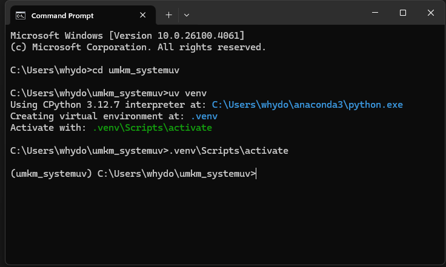
(kasih keterangan tanda nya sukses gimana)

- Begitu kita sudah mengaktifkan environment project kita, selanjutnya kita bisa menginstall package-package yang kita perlukan di project kita, contoh nya kita akan menginstall pandas dan numpy:
```bash
uv add pandas numpy
```
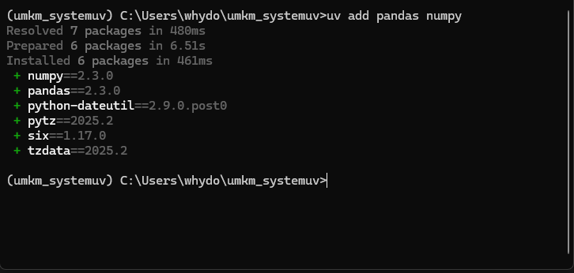

- Ketika kita sudah selesai menggunakan project, kita bisa menonaktifkan environment project kita agar sistem utama kita tetap bersih dan tidak tercampur-campur dari package yang kita install di environment project tadi, caranya dengan menggunakan command berikut:
```bash
.venv\Scripts\deactivate
```
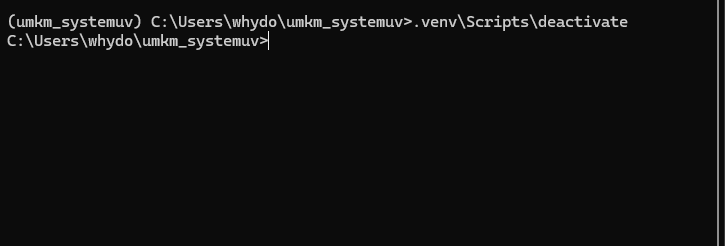

## 🏁Wrap Up
Demikian teman-teman sekalian tutorial setup Anaconda dan UV, semoga setelah ini kita bisa menerapkan management environment dengan baik supaya ketika kita mulai banyak mengerjakan project bisa terhindar dari tumpang tindih library/package yang bisa menyebabkan program kita tidak perform dengan baik, lambat, atau bahkan bisa error karna perbedaan versi package yang digunakan.
Terimakasih!