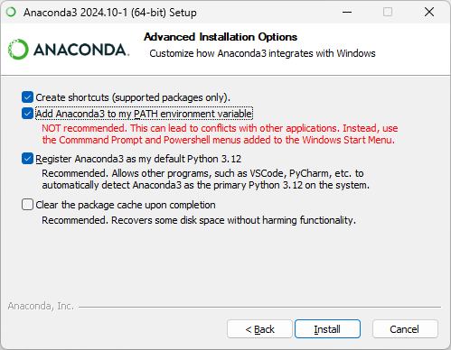
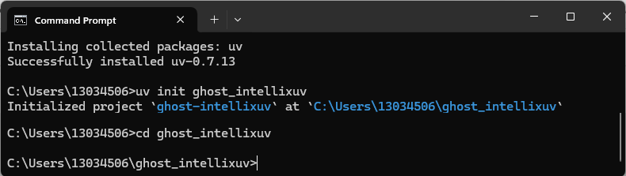

# Panduan Lengkap Setup Anaconda & UV Environment untuk Data Science/AI
Panduan lengkap untuk setup lingkungan Python dengan Anaconda &amp; UV. Anaconda menyediakan ratusan paket siap pakai untuk komputasi ilmiah &amp; analisis data, sementara UV adalah alat manajemen paket berbasis Rust yang cepat untuk lingkungan virtual &amp; instalasi dependensi. Cocok untuk pemula dalam proyek AI/ML. 🚀

### 🌱 Latar Belakang Pentingnya dalam Proyek AI dan ML

##### Lingkungan virtual seperti yang disediakan oleh Anaconda dan UV sangat krusial dalam proyek Artificial Intelligence (AI) dan Machine Learning (ML). Mengapa? Proyek AI/ML sering kali memerlukan berbagai pustaka dan versi Python yang berbeda, seperti TensorFlow, PyTorch, atau scikit-learn, yang dapat bertabrakan jika tidak dikelola dengan baik. Dengan lingkungan terisolasi, Anda dapat:

Menghindari konflik versi antar paket. ✅

Memastikan konsistensi dan reproduktibilitas hasil. 🔄

Mengelola dependensi secara efisien, terutama pada proyek kompleks. ⚙️
Pengaturan ini memungkinkan pengembang fokus pada pengembangan model tanpa khawatir masalah teknis lingkungan, sehingga meningkatkan produktivitas dan kualitas proyek. ⏳

---

## 🛠️ Panduan Setup (Conda dan UV Virtual Environments) 📑

## Bagian 1 : **Instalasi Anaconda**

### **1. Mengunduh Anaconda**

**Apa:** Anaconda adalah distribusi Python yang menyertakan ratusan paket siap pakai, ideal untuk analisis data dan komputasi ilmiah.

**Kenapa:** Mengunduh Anaconda memberikan akses ke alat-alat penting untuk Data Science tanpa instalasi paket manual. Ini memastikan kompatibilitas dan menghemat waktu.

- **Do:** Pilih Python 3.12 untuk kompatibilitas maksimal.
- **Don't:** Hindari versi 32-bit kecuali perangkat Anda tidak mendukung 64-bit.
  
**Langkah-langkah:**

1. Kunjungi **https://www.anaconda.com/download/success**

   
   
3. Pilih penginstal: **Windows Python 3.12 64-Bit Graphical Installer (921.3MB).**
4. **Simpan file di Desktop** atau folder Unduhan.

### **2. Proses Instalasi**

**Apa:** Instalasi melibatkan menjalankan file penginstal dan mengatur konfigurasi sistem.

**Kenapa:** Instalasi yang benar memungkinkan Anaconda terintegrasi dengan sistem, sehingga perintah Conda dan Python dapat diakses dari terminal.

- **Do:** Centang opsi untuk menambahkan Anaconda ke PATH.
- **Don't:** Jangan ubah lokasi instalasi default tanpa alasan kuat.

**Langkah-langkah:**

1. Klik dua kali **Anaconda3-2024.10-1-Windows-x86_64.exe**.

2. Klik **"Next"** pada layar sambutan.
   
   
   
3. Setujui syarat lisensi **(I Agree)**.

   
   
4. Pilih **"Just Me (recommended)"**.

   
   
5. Gunakan lokasi **default** (C:\Users\NAMA_ANDA\anaconda3).

   
   
6. Pilih **Checklist**:

   ✓ Tambahkan Shortcut.
 
   ✓ Tambahkan Anaconda3 ke PATH.
  
   ✓ Jadikan Anaconda3 sebagai Python 3.12 default.
  
   
  
9. Klik **"Install"** dan tunggu **Finish**.

   

   

   

   
   
**Peringatan:** Jika lupa mencentang "Tambahkan ke PATH", Anda harus mengatur PATH secara manual.

### 3. Verifikasi

**Apa:** Verifikasi memastikan Anaconda terinstal dan dapat diakses.

**Kenapa:** Ini mendeteksi masalah seperti PATH yang salah, memungkinkan perbaikan dini.

- **Do:** Buka terminal baru untuk menerapkan perubahan PATH.
- **Don't:** Jangan abaikan pesan kesalahan.

**Langkah-langkah:**

  1. Buka **Command Prompt**.
  2. Ketik dan eksekusi:   **conda --version**

     

  Output seperti **conda 24.9.2** menunjukkan keberhasilan.

### 4. Konfigurasi Variabel Lingkungan PATH

**Apa:** PATH memberi tahu sistem operasi lokasi program seperti Conda dan Python.

**Kenapa:** Tanpa PATH yang benar, perintah Anaconda tidak dapat dijalankan dari terminal.

- **Do:** Verifikasi semua jalur ditambahkan.
- **Don't:** Jangan hapus entri PATH lain.

**Langkah-langkah:**

  1. Tekan **Windows + R**, ketik **sysdm.cpl**, tekan **Enter**.
  2. Pergi ke tab **"Advanced"**, klik **"Environment Variables"**.
  3. Pilih **"Path"** di **"System variables"**, klik **"Edit"**.

     
   
  4. Tambahkan (ganti **NAMA_ANDA**): C:\Users\NAMA_ANDA\anaconda

      
     
  6. Klik **"OK"**, Selesai.

---

## Bagian 2 : Membuat Lingkungan Conda

**Apa:** Lingkungan Conda adalah ruang terisolasi untuk Python dan paket proyek.

**Kenapa:** Isolasi mencegah konflik versi paket, memastikan stabilitas.

- **Do:** Beri nama lingkungan yang relevan.
- **Don't:** Jangan buat di direktori tidak terkait.

**Langkah-langkah:**

  1. Di terminal VS Code (Ctrl+`), ketik:
     
     **conda create -p venv python=3.9**

     
     
  3. Ketik **y** saat diminta.

     

---

## Bagian 3 : Mengaktifkan & Menaonaktifkan Lingkungan

**Apa:** Aktivasi menggunakan Python dan paket dari lingkungan Conda.

**Kenapa:** Ini memastikan perintah menggunakan lingkungan proyek, bukan dasar.

- **Do:** Periksa prompt untuk konfirmasi aktivasi.
- **Don't:** Jangan jalankan perintah sebelum aktif.

**Langkah-langkah:**

  1. Mengaktifkan Lingkungan, Ketik :
       
        **conda activate venv/**
     
  3. Prompt berubah ke (venv) C:\Users\NAMA_ANDA\ghost_intellix>.

  4. Me-Nonaktifkan Lingkungan, Ketik:
     
      **conda deactivate**
     
  5. Prompt berubah ke (venv) C:\Users\NAMA_ANDA\ghost_intellix>.

---

## Bagian 4 : Membuat UV Environment

### 1. Menginstal UV

**Apa:** UV adalah alat manajemen paket dan lingkungan berbasis Rust yang cepat.

**Kenapa:** UV mempercepat instalasi paket, ideal untuk proyek dengan banyak dependensi.

- **Do:** Pastikan lingkungan Conda tidak aktif.
- **Don't:** Jangan gunakan UV untuk paket khusus Conda.

**Langkah-langkah:**

  1. Pastikan lingkungan Conda tidak aktif (jalankan conda deactivate jika perlu).
  2. Ketik :
       **pip install uv**
     
  
      
     
  4. Output seperti **Successfully installed uv-0.7.13** menunjukkan keberhasilan.

#### Catatan tentang folder ghost_intellixuv: Folder ghost_intellixuv akan dibuat di langkah berikutnya (5.2) menggunakan uv init. Perintah ini otomatis membuat folder jika belum ada, karena UV dirancang untuk menginisialisasi direktori proyek baru secara langsung. Anda tidak perlu membuat folder ini secara manual sebelum menjalankan uv init. Untuk memverifikasi folder setelah inisialisasi, ketik dir di CMD untuk melihat daftar direktori.

---

### 2. Menginisialisasi Proyek UV

**Apa:** Inisialisasi membuat struktur proyek UV.

**Kenapa:** Ini menyiapkan direktori proyek dan lingkungan virtual.

- **Do:** Gunakan nama proyek yang jelas.
- **Don't:** Jangan inisialisasi di direktori proyek lain.

**Langkah-langkah:**
 1. Ketik:
  
        
        uv init ghost_intellixuv

     
       Kemudian :
       
        cd ghost_intellixuv

   
    2. Output menunjukkan proyek diinisialisasi di    
    
    C:\Users\NAMA_ANDA\ghost_intellix\ghost_intellixuv.

---

### 3. Menginstal Paket dengan UV

**Apa:** UV menginstal paket dengan cepat menggunakan antarmuka pip.

**Kenapa:** Kecepatan UV menghemat waktu untuk dependensi besar.

- **Do:** Gunakan uv add.
- **Don't:** Jangan campur UV dan pip.

**Langkah-langkah:**

  1. Ketik:
     
      uv add pandas

  2. Output seperti:
    Resolved 7 packages in 244ms

    Installed 6 packages in 663ms
    
     + numpy==2.3.0
     + pandas==2.3.0
     + python-dateutil==2.9.0.post0
     + pytz==2025.2
     + six==1.17.0
     + tzdata==2025.2
   
**Catatan: UV lebih cepat untuk pohon dependensi besar.**

---

### 4. Menonaktifkan Lingkungan UV

**Apa:** Menonaktifkan mengembalikan ke lingkungan global.

**Kenapa:** Ini mencegah perubahan tak sengaja.

- **Do:** Nonaktifkan setelah selesai.
- **Don't:** Jangan biarkan aktif.

**Langkah-langkah:**

    1. Ketik: .venv\Scripts\deactivate
    
  

    2. Prompt kembali ke C:\Users\NAMA_ANDA\ghost_intellix\ghost_intellixuv>.

---

### 5. Perbandingan Conda vs UV
**Apa:** Perbandingan fitur Conda dan UV.

**Kenapa:** Membantu memilih alat sesuai kebutuhan proyek.

- **Do:** Gunakan Conda untuk ilmiah, UV untuk cepat.
- **Don't:** Jangan campur keduanya tanpa alasan.

| Fitur | **Anaconda**| **UV** |
|----------|-------------|--------|
| **Kecepatan Instalasi**| Sedang | Sangat Cepat |
| **Manajemen Paket** | Terintegrasi | Kompatibel pip |
| **Pembuatan Lingkungan** | conda create | uv venv |
| **Aktivasi Lingkungan** | conda activate | .venv\Scripts\activate |
| **Lintas Platform** | Ya | Ya |
| **Terbaik Untuk** | Komputasi ilmiah | Pengembangan cepat |

---

### 6. Daftar Paket yang Direkomendasikan
**Apa:** Paket penting untuk Data Science, Machine Learning, dan AI.

**Kenapa:** Memastikan alat yang diperlukan tersedia.

- **Do:** Perbarui versi paket secara berkala.
- **Don't:** Jangan instal paket yang tidak diperlukan.

**Langkah-langkah:**

Buat **requirements.txt:**

Instal:

    uv add -r requirements.txt

atau

    pip install -r requirements.txt

---

### 7. Panduan Pemecahan Masalah
**Apa:** Solusi untuk masalah umum selama pengaturan.

**Kenapa:** Memecahkan masalah cepat meminimalkan hambatan.

- **Do:** Catat pesan kesalahan.
- **Don't:** Jangan abaikan peringatan.

**_Masalah 1: Perintah Conda Tidak Dikenali_**

- **Gejala:** 'conda' is not recognized
- **Solusi:** Verifikasi instalasi Anaconda.
            Periksa PATH.
            Jalankan conda init cmd.exe, mulai ulang terminal.

**_Masalah 2: Aktivasi Lingkungan Gagal_**

- **Gejala:** Script execution is disabled
- **Solusi:** Jalankan PowerShell sebagai Administrator.
            Ketik Set-ExecutionPolicy RemoteSigned.
            Pilih "Y".
            
**_Masalah 3: Kesalahan Instalasi Paket_**

- **Gejala:** Could not find a version
- **Solusi:** Perbarui pip: python -m pip install --upgrade pip.
            Periksa kompatibilitas Python.
            Coba versi paket lain.

---
_Happy Coding_

    
     
